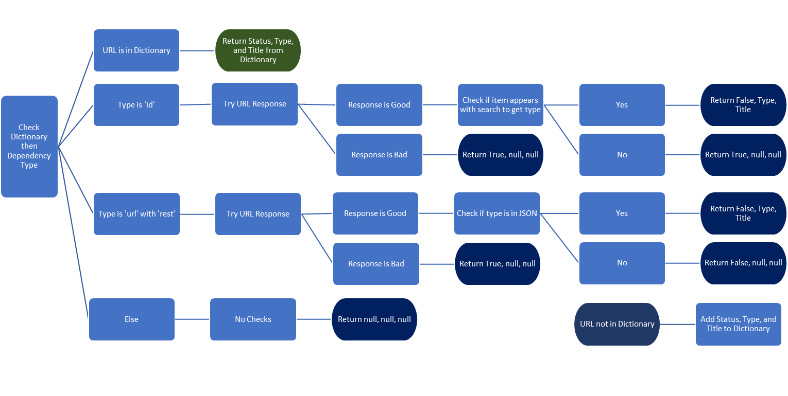

# Code Breakdown
## Cell 1: Input Parameter
Variables that will need to be altered to run this script. See *Input Parameters* section.

## Cell 2: Import Modules, Login to Portal
Import necessary modules and login to ArcGIS Portal. Module uses:
- `warnings` - Functionality for warnings to prompt users on potential issues with the code or input parameters.
- `arcgis` (`GIS`), `arcpy` (with `env`)- Functions for accessing portal and using spatial-related functions.
- `pandas` (`pd`), `numpy` (`np`), `time` - Data manipulation finctions. Pandas DataFrames are the main way data is manipulated in this script.
- `json`, `requests` - Reading web JSON and making requests to webpages to check if links are broken.
- `networkx` (`nx`), `matplotlib.pyplot` (`plt`) - Creating network graphs.

## Cell 3: Defined Functions
Define functions used with Pandas DataFrames.
- `restType` - corrects the `dependencyType` field received from the `dependent_to` and `dependent_upon` functions. Dependencies with the type `id` sometimes are not actually item IDs and are instead REST URLs. This function checks if any items with the `id` dependency type contain a link within it and converts their type to `url`.

- `urlGen` - creates URLs that are used to check for broken links. If the dependency type is `url`, this is copied over. If the dependency type is `id`, a new URL is created using the portal URL and this item ID. For all other item types, no URL is created.
- `testLink` - checks if links to dependencies are broken and returns the item type and title of that dependency if it is available with JSON. This function uses a dictionary to store all URLs that are checked, status, and type to prevent needing to check the same URL multiple times. When this function runs, it first checks the dictionary, then proceeds to check the dependency type if it isn’t found. See the visualization below for a simplified view of this function's code. Return in the visualization shows the values for item type, title, and broken status that are determined.

- `combineColumns` - combines data from two different data sources in a table into one column. Using another column as a check, values from a secondary column are added to the primary column if the primary column does not have a value for that row. An example of this function being used is when the type of an item is in two different sources DataFrames, resulting in two separate columns that must be combined.

## Cell 4: Get All Portal Items & Groups
To get information on item in a Portal, you primarily need to use `gis.content.search`. One issue though is the maximum number of items that can be returned. If a portal contains more than 500 items, they cannot all be queried at once due to the max item limit. At the same time, pagination (i.e., being able to choose a starting location in the list of items) is not supported. To get around this, we will have to search by user, then combine this data. For this, `gis.users.search` is used, which returns a list of all users in the organization (thankfully the limit on this is higher than content searches). From this list, we’re only really interested in getting a list of usernames and checking the `storageUsage` column. `storageUsage` displays how much space (bytes) a user is taking up, so instead of querying every user, we can use this to filter down to only users who are using up storage and therefore have items in the portal. Some users have only private items, so they will just return blank content lists, but all Portal contents should be owned by this set of users. Note that `gis.users.search` does not get ESRI created users, so this automatically filters those out. From our filtered user list (`users`) we can iterate through each user to get their contents then append that to a single list (`itemInfo`). If a user has more than 500 items, which can happen with admin profiles, a search is done for the user and each item type that could exist in Portal. If a user has more than 500 items of a single type, it is not possible to get all of the items without additional query parameters. After compiling our content list, we can apply the filters set at the beginning to exclude/include certain item types.

`gis.content.search` does not create a column showing what groups an item is, so this data has to be created separated then joined. To get groups from the Portal, we can use `gis.groups.search` with no query. This returns a list (`groups`) with all groups and some info about them. From this, the only data we actually need is the group name and group ID. To get the items associated with each group, we’ll need to iterate through each group ID in the groups and use the `groups.content` function to get a list of contents for that ID (`groupItem`). Each time `groupItem` is generated, it is added to a list of all group contents (`groupItems`). This list of contents does not include the name or ID of the group it originates from since this is essentially just doing `gis.content.search` with the group as the query, so to add this we will create a list with group names (`groupName`) that matches the index of `groupItems`. After getting `groupItem`, we use the number of items in the list to determine how many times we add that group name to the `groupName` list. Now we have a list of all the contents within a group and a list of group names that corresponds to the content list. From here, we can simply convert the content list to a DataFrame and add the `groupName` list as a new column. This DataFrame does have a lot of extra data on each item that we don’t need from `groups.content`, so now we can drop all columns but the item ID (used as a key later on) and the group name. The final thing to do is use `groupby` with `.agg` to combine any items that are in multiple groups.

## Cell 5: Get Dependencies
As of writing, the `dependent_to` function does not work, but it is included in this documentation as if it does.

First, we create two empty lists, `dependencies` and `dependType`. Using the previously created list of Portal contents, we will iterate through each and get the dependencies for each item with the `dependent_upon` and `dependent_to` function and append it to the `dependencies` list. At the same time for each iteration a value corresponding to the type of relationship is appended to `dependType` after `dependent_upon` or `dependent_to` run. After `dependencies` can be converted to a DataFrame and `dependType` added as a new column (`dependencyRelate`). `itemInfo` is also converted to a DataFrame here and total columns are created from filtered versions of `dependencies` based on the relationship type. 

Before manipulating the data in `dependencies`, we add the `id` column from `itemInfo` to use as a key later. This column gets renamed to `itemID` due to a later conflict with another column that is generated also named `id`. At this point, `dependencies` only has one row for each item ID, with dependencies lists in a nested JSON format. To seperate out each column into ones with one dependency each, we use the `explode` method. Now we have a column with a single dependency relationship, but with multiple pieces of info contained in a single column as JSON. Use `json_normalize` to convert this column into multiple columns for each keys. Normalization deletes everything but the contents of the original column, so this gets added as `dependNorm` to preserve the original data, then is merged back later. `dependNorm` now contains a column for each type of dependency that exists in the dataset. Since we just want a single column of types, all of these can be concatenated together as a new column (`dependencyType`). This column can now be added back to the original DataFrame using index values, as normalization preserves the index of the original DataFrame. There are some rows that don't contain a dependency, so these can be removed now since the index doesn't need to be preserved.

Now we are left with `dependencies` which lists every dependency relationship, the type of relationship, and type of dependency. We can also get more info about the dependencies; namely a live url link for any that are just item IDs, determine if links are broken, and add the type of item a dependency is and its title. For this, we use apply, which lets you create defined functions and use them on DataFrame columns. The previously defined `restType`, `urlGen`, and `testLink` functions are used (see documentation on *Cell 3*). After applying these functions, we can filter out any columns that are not ones we want to keep giving our final table on dependency relationships (excluding adding X, Y positions if converting to a feature layer).

**Note:** The `testLink` function returns all three values as a list then those are seperated into new columns. This is not ideal, but there appears to be limitations with the `apply` method and outputting to multiple columns.

## Cell 6: Format/Clean Up Item Info
In the `itemInfo` DataFrame, we have most of the info we would want, so now we can add a few extra fields and reformat some columns. Previously we created a DataFrame with groups and the items in them, which we can join to `itemInf`o here using the `id` field in both DataFrames. Next, we can reformat the dates on the `created` and `modified` fields to make them into readable dates. Items without tags can have their blank lists removed by converting the column to strings then replacing `[]` with empty strings in the tags field. For the `access` and `contentStatus` fields, we can change the pre-defined values that appear here to be more consistent with capitalization and naming. At this point, the only thing left to do is drop any columns that aren’t wanted and rename the `id` field to `itemID` (consistent with the field in `dependencies`). 

## Cell 7: Generate Geometry
If `generateNodes` is True, `dependencies` is filtered to remove ArcGIS utility services and server ID dependencies. These items generally do not need to be visualized and due to their number of connections creates extra 'mess' when constructing the graph. Items filtered out `dependencies` are added to `dependencies_filter` to be added back in later.Using `networkx`, we construct a graph object using the  `spring_layout` function and the `dependencies` data. This graph is stored in a DataFrame (`nodeXY`) that can be merged with our other datasets to get location data. Due to potential issues with ArcGIS Portal not accepting a shapefile that crosses the international dateline (and potentially equator), we add 1 to the `X` and `Y` fields. 

To get the final point data, we can merge `itemInfo` and `nodeXY` using a outer join, keeping all records from both tables, while matching any with the same `itemID`. For any items not in our Portal, there will be no data except in the `Node`, `X`, and `Y` fields. By merging data from `dependencies` to `itemInfo`, we can add item types, URLs, and titles. Because these get added as seperate fields, we can use the `combineColumns` function (see documentation on *Cell 3*) to add the data from these new fields to the appropriate original field if the original field is blank. Now we just drop these extra columns. Using the `combineColumns` function we can also add itemIDs from the `itemID` field to the `Node` field to use as as a single identifier for each point in the dataset. 

To get the final line data, we just merge the `X` and `Y` fields from `nodeXY` to the `itemID` and `dependency` fields in `dependencies`. These get renamed to `X1`,`Y1` and `X2`,`Y2` accordingly. Next, drop the `node_` columns that were added in the merge. Finally append the `dependencies_filter` DataFrame to `dependencies` to get all relationships that were not graphed.

## Cells 8-11: Export to CSV, Features, or GDB Tables
If you have chosen to export CSV files and have not specified a path for them, they will be exported into the parent folder of the geodatabase, with the path created from the `workspace` path. If `outPath` is specified, this is done to this path instead. Both methods use the `pandas` function `to_csv` to create the files, with `pointName` and `lineName` respectively as the file names.

If you have chosen to export as features, datatypes and blank records for `itemInfo` and `dependencies` get updated to fit the requirements for `arcpy`. Finally using `arcpy`'s `XYTableToPoint` and `XYToLine` functions gives the final feature classes. 

If you have chosen to export to GDB tables, these will be added to the geodatabase without any spatial data unless geometry was generated. 